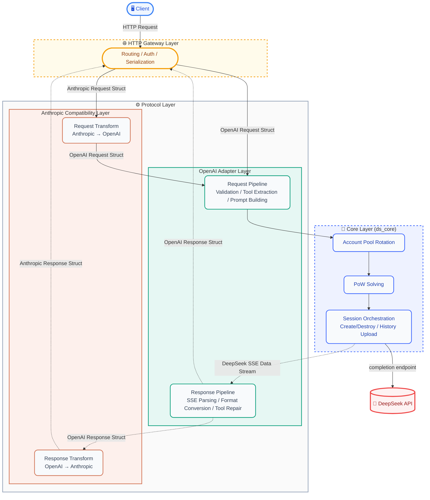
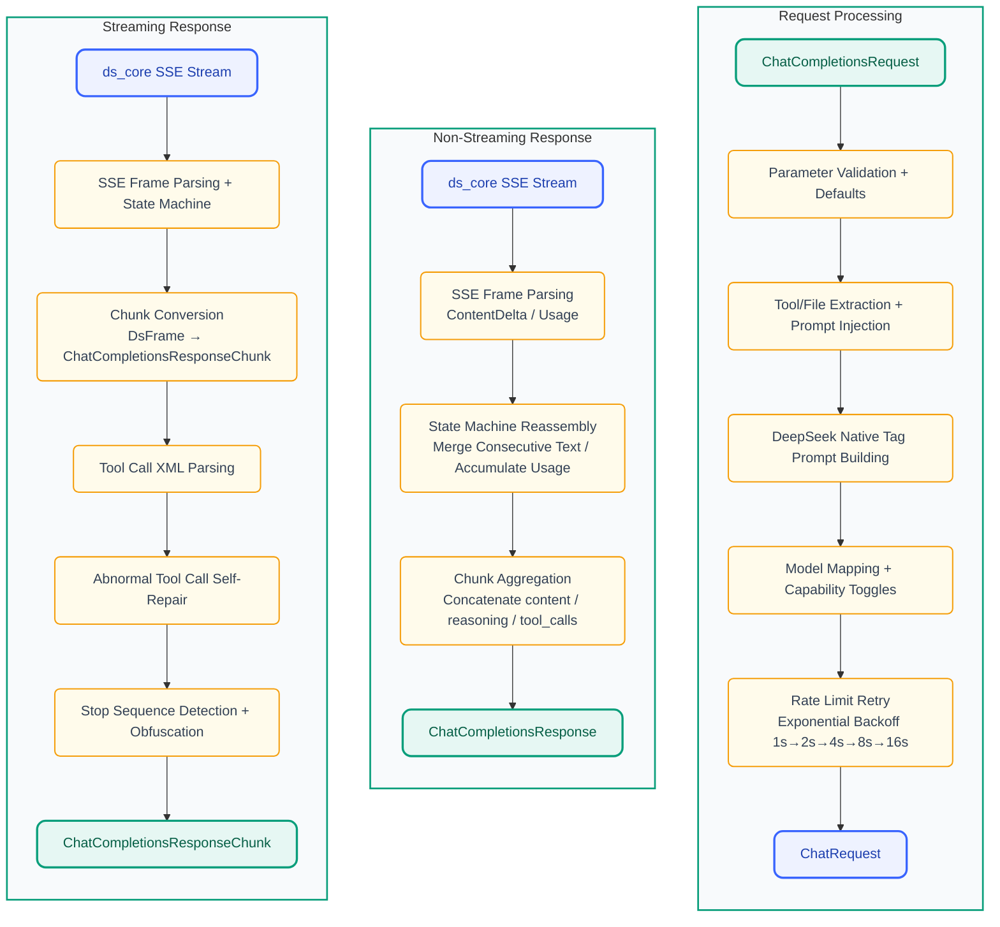
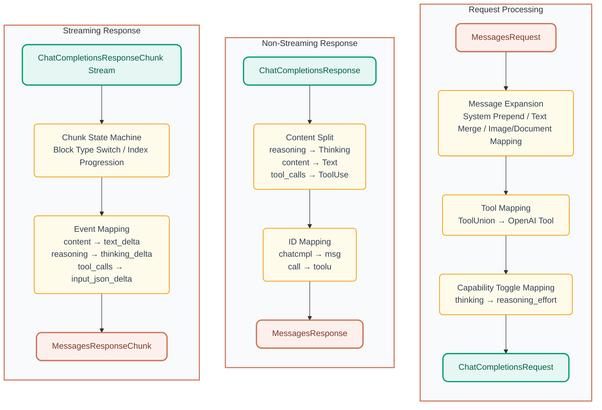

<p align="center">
  
</p>

<h1 align="center">DS-Free-API</h1>

<p align="center">
  <a href="LICENSE"></a>
  
  
  
</p>
<p align="center">
  
  
  
</p>

[中文](README.zh.md)

Reverse-proxies the free DeepSeek web chat interface and adapts it into standard OpenAI and Anthropic compatible API protocols (currently supporting chat completions and messages, including streaming responses and tool calls).

## Project Highlights

- **Zero-cost API proxy**: Uses DeepSeek's free web interface, no official API Key needed, provides OpenAI / Anthropic compatible endpoints
- **Dual protocol support**: Simultaneously compatible with OpenAI Chat Completions and Anthropic Messages API, plug-and-play with mainstream clients
- **Tool call ready**: Full OpenAI function calling implementation, tool parsing + three-layer self-repair pipeline (text repair → JSON repair → model fallback), covering 10+ abnormal formats
- **File upload ready**: Supports automatic upload of inline data URL files from OpenAI `file` / `image_url` content parts and Anthropic `image` / `document` content blocks to DeepSeek sessions; HTTP URLs automatically trigger search mode, allowing the model to directly access link content
- **Oversized prompt fallback**: When prompts exceed model limits, automatically uses chunked completion + file upload to bypass
- **Web admin panel**: Built-in visual panel with account pool status, API Key management, request logs, i18n support, theme switching, and config hot-reload out of the box
- **Rust implementation**: Single executable + single TOML config, cross-platform native high performance (web panel compiled-in, ready to use)
- **Multi-account pool**: Least-recently-used rotation (DashMap lock-free reads), supports horizontal scaling for concurrency

## Quick Start

### Binary Usage

1. Download the corresponding platform archive from [releases](https://github.com/NIyueeE/ds-free-api/releases) and extract
2. Copy `config.example.toml` to `config.toml` and fill in accounts (optional, can also be configured in the admin panel after startup)
3. Run `./ds-free-api`
4. Visit `http://127.0.0.1:22217/admin` to set the admin password, then create API Keys and manage accounts in the panel

```bash
./ds-free-api
./ds-free-api -c /path/to/config.toml
RUST_LOG=debug ./ds-free-api
```

> **Concurrency**: The free API has session-level rate limits. This project has built-in rate limit detection + exponential backoff retry for stability.
> Recommended parallelism = number of accounts / 2. Supports starting without config.toml and adding accounts via the admin panel.

### Docker Usage

```bash
docker compose -f docker/docker-compose.yaml up -d
```

Compose configuration at [docker/docker-compose.yaml](./docker/docker-compose.yaml).

Admin panel at `http://localhost:22217/admin`, set the admin password on first visit.
`config/` and `data/` directories are bind-mounted into the container, config changes auto-persist to the host.

### Free Test Accounts

Please register on your own, see [issue #62](https://github.com/NIyueeE/ds-free-api/issues/62) for reference methods.

## API Endpoints

| Method | Path | Description |
|--------|------|-------------|
| GET  | `/`   | Redirect to admin panel |
| GET  | `/health` | Health check |
| POST | `/v1/chat/completions` | Chat completion (supports streaming and tool calls) |
| GET  | `/v1/models` | Model list |
| GET  | `/v1/models/{id}` | Model details |
| POST | `/anthropic/v1/messages` | Anthropic Messages (supports streaming and tool calls) |
| GET  | `/anthropic/v1/models` | Model list (Anthropic format) |
| GET  | `/anthropic/v1/models/{id}` | Model details (Anthropic format) |

Admin panel at `/admin`, guides admin password setup on first visit.

## Model Mapping

`model_types` in `config.toml` (default `["default", "expert", "vision"]`) auto-maps:

| OpenAI Model ID     | DeepSeek Type |
| ------------------ | ------------- |
| `deepseek-default` | Fast mode     |
| `deepseek-expert`  | Expert mode   |
| `deepseek-vision`  | Vision mode   |

Optional aliases via `model_aliases` aligned by index with `model_types`, no aliases by default. Empty strings are skipped:

```toml
# model_aliases = ["", "deepseek-v4-pro"]  → deepseek-v4-pro maps to expert (index 1)
model_aliases = []
```
Anthropic compatibility layer uses the same model IDs, invoked via `/anthropic/v1/messages`.

### Capability Toggles

- **Deep thinking**: Enabled by default. To explicitly disable, add `"reasoning_effort": "none"` to the request body.
- **Web search**: Enabled by default (DeepSeek backend injects a stronger system prompt in search mode, improving tool call compliance). To explicitly disable, add `"web_search_options": {"search_context_size": "none"}` to the request body.
- **File upload**: Supports inline files (data URL) auto-uploaded to DeepSeek sessions, and HTTP URLs auto-trigger search mode:

  **OpenAI side:**
  ```json
  {"type": "file", "file": {"file_data": "data:text/plain;base64,...", "filename": "doc.txt"}}
  {"type": "image_url", "image_url": {"url": "data:image/png;base64,..."}}
  {"type": "image_url", "image_url": {"url": "https://example.com/img.jpg"}}
  ```

  **Anthropic side:**
  ```json
  {"type": "image", "source": {"type": "base64", "media_type": "image/png", "data": "..."}}
  {"type": "document", "source": {"type": "base64", "media_type": "text/plain", "data": "..."}}
  {"type": "image", "source": {"type": "url", "url": "https://example.com/img.jpg"}}
  ```

### Tool Call Tag Hallucination

Built-in fuzzy matching (fullwidth `|`<=>`|`, `▁`<=>`_`), automatically covers most variants. If the model outputs fallback tags with different formats, add them in the control panel, or append to `[ds_core]` in `config.toml`:

```toml
tool_call.extra_starts = ["<|tool_call_begin|>", "<tool_calls>", "<tool_call>"]
tool_call.extra_ends = ["<|tool_call_end|>", "</tool_calls>", "</tool_call>"]
```

## Web Admin Panel

After starting the service, visit `http://127.0.0.1:22217/admin` to access the admin panel:

- **Dashboard**: Request statistics, account pool status overview
- **Account Pool**: View/add/remove accounts, manually re-login Error status accounts
- **API Keys**: Create/delete API Keys, masked display
- **Models**: Available model list and details
- **Config**: Current runtime config (masked)
- **Logs**: Recent request logs and runtime logs

<p align="center">
  
  <br>
  <em>Admin Panel Dashboard</em>
</p>

<p align="center">
  
  <br>
  <em>Config Page</em>
</p>

On first visit, guides admin password setup (bcrypt hash storage). After login, issues JWT (24h validity), supports revoking old tokens on password reset.

## Environment Variables

| Variable | Default | Description |
|----------|---------|-------------|
| `RUST_LOG` | `info` | Log level (`trace` / `debug` / `info` / `warn` / `error`) |
| `DS_DATA_DIR` | `.` (current directory) | Data directory, stores `logs/runtime.log` and `stats.json` |
| `DS_CONFIG_PATH` | `./config.toml` | Config file path, lower priority than `-c` argument |

## Security

- **Admin panel**: JWT authentication + bcrypt password hashing + login failure rate limiting (5 failures locks for 5 minutes)
- **API access**: API Key authentication created via admin panel (HashSet O(1) lookup)
- **CORS**: Configurable allowed Origin list, default only `http://localhost:22217`
- **Sensitive info**: Account IDs masked in response headers, request bodies not logged, persistent file permissions 0600

## Development

### Design Philosophy

**One `config.toml` reflects all runtime state**. Admin panel changes to config are immediately persisted to `config.toml` and hot-reloaded into the running service.

**No unnecessary runtime system dependencies introduced**. The project always prioritizes pure Rust or statically linked dependencies (e.g. `rustls` → `wreq` + BoringSSL), ensuring the compiled artifact is a single binary with no external `.so`/`.dll` dependencies, ready to use after download.


### Brief Architecture Diagram:



### Data Pipelines:

#### OpenAI (chat_completions) Processing Pipeline:



#### Anthropic (messages) Processing Pipeline:



Detailed development guide (building, testing, Docker deployment, e2e tests, etc.) at [docs/development.md](./docs/development.md).
## License

[GNU General Public License v3.0](LICENSE)

[DeepSeek Official API](https://platform.deepseek.com/top_up) is very affordable, please support the official service.

The original intention of this project is to experience the latest models being A/B tested on the official web interface.

**Commercial use is strictly prohibited**. Avoid putting pressure on official servers, otherwise you bear the risk.
